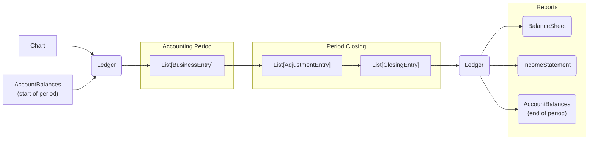

# abacus

[](https://github.com/epogrebnyak/abacus/actions/workflows/.pytest.yml)

A minimal, yet valid double-entry accounting system, provided as `abacus` Python package and `jaba` command line tool.

## Documentation

<https://epogrebnyak.github.io/abacus/>

## Workflow

`abacus` allows to specify a chart of accounts, create a ledger with starting balances,
post entries through accounting period, close accounts at period end and produce financial reports.



## Quotes about `abacus`

[](https://www.reddit.com/r/Accounting/comments/136rrit/wrote_an_accounting_demo_in_python/)

> I think it's a great idea to mock-up a mini GL ERP to really get a foundational understanding of how the accounting in ERP works!

> I teach accounting information systems... I'd be tempted to use abacus as a way of simply showing the structure of a simple AIS.

> Hey, what a cool job, thanks much. Do you plan to make a possibility for RAS accounting?

## Install

```
pip install git+https://github.com/epogrebnyak/abacus.git
```

This will install both `abacus` package and `jaba` command line tool.

## Usage

### Step by step code example

1. Define a chart of accounts of five types (assets, equity, liabilities, income and expenses).

   Retained earnings account name must be in chart, so that we can close accounts at period end.

```python
from abacus import Chart, Entry, BalanceSheet, IncomeStatement

chart = Chart(
    assets=["cash", "ar", "goods", "ppe"],
    expenses=["cogs", "sga"],
    equity=["equity"],
    retained_earnings_account="re",
    liabilities=["dividend_due", "ap"],
    income=["sales"]
)
```

2.  You can also specify contra accounts.

In example below `depreciation` contra account offsets
`ppe` (property, plant, equipment) account
and discounts and cashback contra accounts
offset `sales` account.

You can do the same at once when creating `Chart`:

```python
chart = Chart(
    assets=["cash", "ar", "goods", "ppe"],
    expenses=["cogs", "sga"],
    equity=["equity"],
    retained_earnings_account="re",
    liabilities=["dividend_due", "ap"],
    income=["sales"],
    contra_accounts = {
      "ppe": ["depreciation"],
      "sales": ["discounts", "cashback"]
    }
)
```

3. Next create a general ledger (book) based on the chart of accounts.

```python
book = chart.book()
```

4. Add accounting entries using account names from the chart of accounts and amounts.

```python
e1 = Entry(dr="cash", cr="equity", amount=1000)  # pay in shareholder equity
e2 = Entry(dr="goods", cr="cash", amount=250)    # acquire goods worth 250
e3 = Entry(cr="goods", dr="cogs", amount=200)    # sell goods worth 200
e4 = Entry(cr="sales", dr="cash", amount=400)    # for 400 in cash
e5 = Entry(cr="cash", dr="sga", amount=50)       # administrative expenses
book = book.post_many([e1, e2, e3, e4, e5])
```

5. Close book at accounting period end.

```python
book = book.close()
```

You can also use chained operation syntax for steps 3-5:

```python
book = (chart.book()
  .post(dr="cash", cr="equity", amount=1000)
  .post(dr="goods", cr="cash", amount=250)
  .post(cr="goods", dr="cogs", amount=200)
  .post(cr="sales", dr="cash", amount=400)
  .post(cr="cash", dr="sga", amount=50)
  .close()
)
```

6. Make income statement and balance sheet.

```python
income_statement = book.income_statement()
balance_sheet = book.balance_sheet()
```

Check:

```python
from abacus import IncomeStatement, BalanceSheet

assert income_statement == IncomeStatement(
    income={'sales': 400},
    expenses={'cogs': 200, 'sga': 50}
)
assert balance_sheet == BalanceSheet(
    assets={"cash": 1100, "ar": 0, "goods": 50, "ppe": 0},
    capital={"equity": 1000, "re": 150},
    liabilities={"dividend_due": 0, "ap": 0}
)
```

7. Print balance sheet and income statement to screen
   with verbose account names and rich formatting.

```python
from abacus import RichViewer

rename_dict = {
    "re": "Retained earnings",
    "ar": "Accounts receivable",
    "ap": "Accounts payable",
    "ppe": "Fixed assets",
    "goods": "Inventory (goods for sale)",
    "cogs": "Cost of goods sold",
    "sga": "Selling, general and adm. expenses",
}
rv = RichViewer(rename_dict, width=60)
rv.print(balance_sheet)
rv.print(income_statement)
```

8. Use end balances from current period to initialize book at the start of next accounting period.

```python
end_balances = book.nonzero_balances()
assert end_balances == {'cash': 1100, 'goods': 50, 'equity': 1000, 're': 150}
next_book = chart.book(starting_balances=end_balances)
```

## Command line

Similar operations with chart and ledger can be performed on the command line without writing any Python code.

### Create chart of accounts

```bash
jaba chart chart.json unlink
jaba chart chart.json touch
jaba chart chart.json set --assets cash ar goods ppe
jaba chart chart.json set --capital equity
jaba chart chart.json set --retained-earnings re
jaba chart chart.json set --liabilities ap dividend_due
jaba chart chart.json set --income sales
jaba chart chart.json set --expenses cogs sga
jaba chart chart.json offset ppe depreciation
jaba chart chart.json offset sales discounts cashback
jaba chart chart.json list --validate
jaba chart chart.json make store.json
```

### Post entries to ledger and close

```bash
jaba ledger store.json post cash equity 1000
jaba ledger store.json post goods cash 300
jaba ledger store.json post cogs goods 250
jaba ledger store.json post ar sales 440
jaba ledger store.json post discounts ar 41
jaba ledger store.json post cash ar 150
jaba ledger store.json post sga cash 69
jaba ledger store.json close
jaba ledger store.json list --business
jaba ledger store.json list --close
```

### Report

```bash
jaba report store.json --balance-sheet
jaba report store.json --income-statement
```

### Account information

Show balances of all accounts or balance of a specific account:

```bash
jaba balances store.json show --skip-zero
jaba balances store.json show cash
```

`assert` command will make the program complain
if account balance is not equal to provided value.
This is useful for testing.

```bash
jaba balances store.json assert cash 781
jaba balances store.json assert ar 241
jaba balances store.json assert goods 50
jaba balances store.json assert equity 1000
jaba balances store.json assert re 80
```

You can save end balances to a file to initialize next period.

```bash
jaba balances store.json show --skip-zero --json > end_balances.json
```

## Feedback

Anything missing in `abacus`?
Got a good use case for `abacus`?
Used `abacus` for teaching?

Feel free to contact `abacus` author
in [issues](https://github.com/epogrebnyak/abacus/issues),
on [reddit](https://www.reddit.com/user/iamevpo)
or via [Telegram](https://t.me/epoepo).

Your feedback is highly appreciated and helps steering development of `abacus`.
