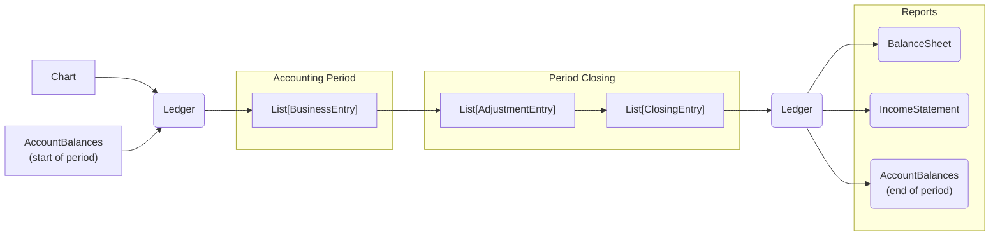

# Workflow

`abacus` allows to specify a chart of accounts, create a ledger with starting balances,
post entries through accounting period, close accounts at period end and produce financial reports.

